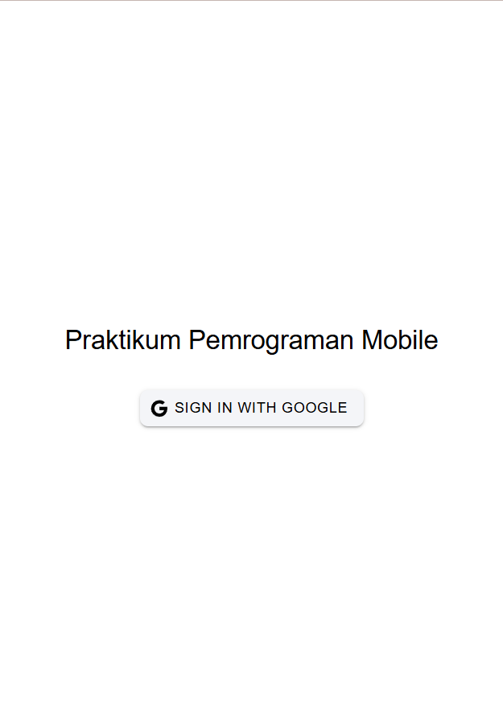
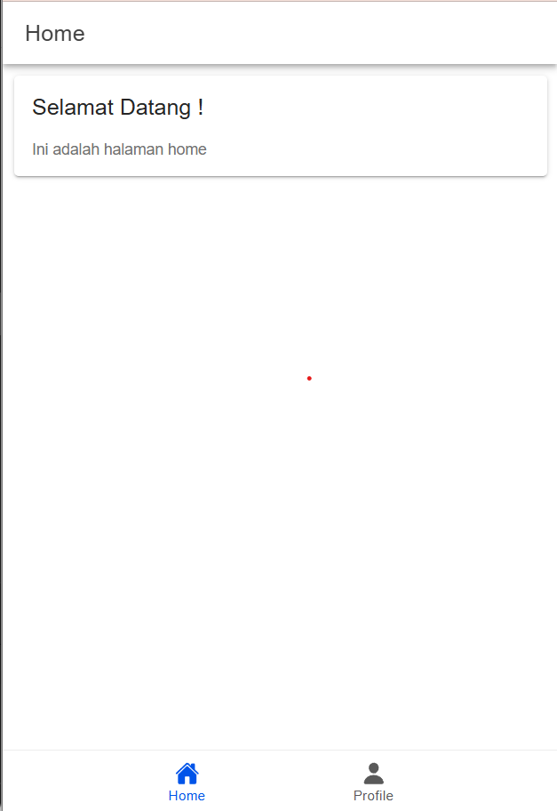
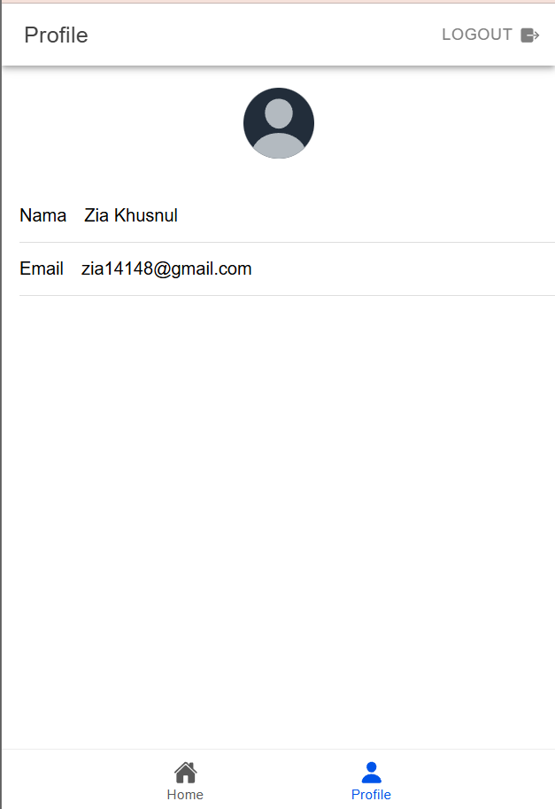

# Tugas 9
Nama       : Zia Khusnul Fauzi Akhmad

NIM        : H1D022023

Shift Baru : Shift D

Ini adalah aplikasi autentikasi sederhana menggunakan Ionic Vue dan Firebase. Berikut adalah bagian-bagian penting dari kode dalam proyek ini.

## Screenshot
### Halaman Login


Pada halaman login terdapat sebuah tombol untuk login dengan Google. Ketika tombol ini ditekan, pengguna akan diarahkan ke halaman login Google untuk memilih akun yang akan digunakan.

Ketika pengguna menekan tombol sign in, kode dibawah akan dijalankan

``` typescript
    const loginWithGoogle = async () => {
        try {
            await GoogleAuth.initialize({
                clientId: '2828981*************.apps.googleusercontent.com',
                scopes: ['profile', 'email'],
                grantOfflineAccess: true,
            });

            const googleUser = await GoogleAuth.signIn();

            const idToken = googleUser.authentication.idToken;

            const credential = GoogleAuthProvider.credential(idToken);

            const result = await signInWithCredential(auth, credential);

            user.value = result.user;

            router.push("/home");
        } catch (error) {
            console.error("Google sign-in error:", error);
            
            const alert = await alertController.create({
                header: 'Login Gagal!',
                message: 'Terjadi kesalahan saat login dengan Google. Coba lagi.',
                buttons: ['OK'],
            });

            await alert.present();

            throw error;
        }
    };
```

Fungsi loginWithGoogle() digunakan untuk menangani proses login dengan Google. Fungsi ini dipanggil saat tombol login dengan Google ditekan.

GoogleAuth.initialize() digunakan untuk menginisialisasi autentikasi dengan Google. Fungsi ini menerima objek konfigurasi dengan clientId, scopes, dan grantOfflineAccess.

clientId diisi dengan ID OAuth 2.0 yang diberikan oleh Google saat aplikasi didaftarkan di Google Cloud Console.

Jika proses inisialisasi berhasil, GoogleAuth.signIn() akan meminta pengguna untuk memilih akun Google yang akan digunakan untuk login.

Setelah pengguna memilih akun, GoogleAuth.signIn() akan mengembalikan objek googleUser yang berisi informasi pengguna yang berhasil login.

googleUser.authentication.idToken berisi token identitas yang diterima dari Google. Token ini kemudian digunakan untuk membuat credential dengan GoogleAuthProvider.credential(idToken).

signInWithCredential(auth, credential) digunakan untuk melakukan login dengan Firebase menggunakan credential yang telah dibuat.

Jika login berhasil, user.value akan diisi dengan informasi pengguna yang berhasil login. Kemudian, pengguna akan diarahkan ke halaman home

Jika terjadi kesalahan saat login, pesan error akan dicetak di konsol dan alert akan ditampilkan kepada pengguna.


### Halaman Home

Tidak ada apapun yang ditampilkan pada halaman home selain pesan selamat datang. Halaman ini hanya dapat diakses oleh pengguna yang sudah login.

Pada bagian bawah halaman home terdapat tab bar yang berisi dua tab: Home dan Profile. Tab Home akan menampilkan halaman home, sedangkan tab Profile akan menampilkan halaman profile.

### Halaman Profile

Pada halaman profile terdapat informasi pengguna yang sedang login. Informasi ini diambil dari Firebase setelah pengguna berhasil login.

Selain itu, terdapat tombol untuk logout. Ketika tombol ini ditekan, pengguna akan keluar dari aplikasi dan diarahkan kembali ke halaman login.

Ketika pengguna menekan tombol logout, kode dibawah akan dijalankan

``` typescript
    const logout = async () => {
        try {
            await signOut(auth);
            await GoogleAuth.signOut();
            user.value = null;
            router.replace("/login");
        } catch (error) {
            console.error("Sign-out error:", error);
            throw error;
        }
    };
```

Fungsi logout digunakan untuk menangani proses logout. Fungsi ini dipanggil saat tombol logout ditekan.
signOut(auth) digunakan untuk melakukan logout dari Firebase.
GoogleAuth.signOut() digunakan untuk melakukan logout dari Google.
Setelah itu value dari objek user akan diubah menjadi null dan pengguna akan diarahkan kembali ke halaman login.
Jika terjadi kesalahan saat logout, pesan error akan dicetak di konsol dan error akan dilempar.


